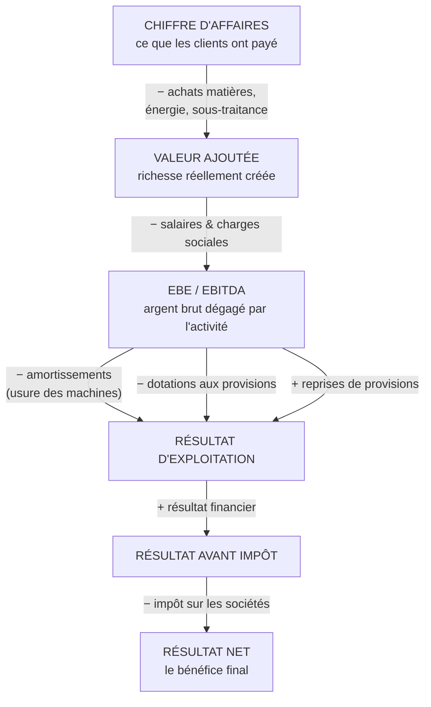
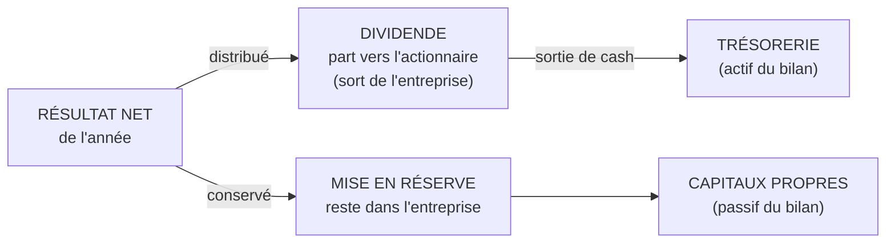
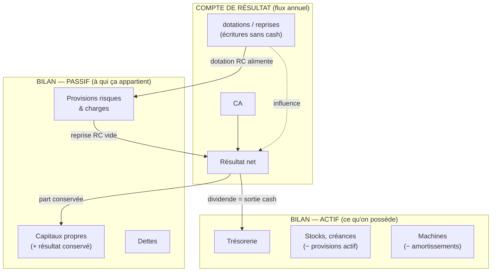
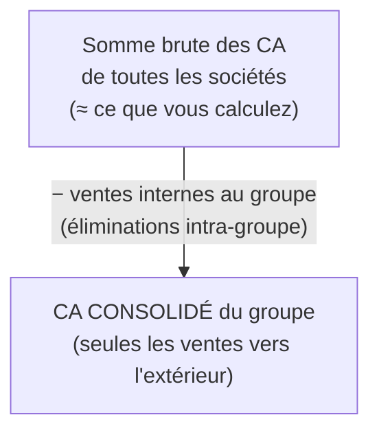

Excellente double question. Je vais séparer les deux, avec un vocabulaire simple mais exact, et des diagrammes.

## 1. Le circuit de l'argent : du CA aux capitaux propres

D'abord, il faut distinguer **trois mondes comptables** qui ne se mélangent pas :

| Monde | Question à laquelle il répond | Type |
|-------|-------------------------------|------|
| **Compte de résultat** | Ai-je gagné de l'argent cette année ? | Flux (sur 1 an) |
| **Bilan – actif** | Qu'est-ce que je possède ? | Stock (à un instant T) |
| **Bilan – passif** | À qui appartient ce que je possède ? | Stock (à un instant T) |

### Le compte de résultat (le film de l'année)



**Le point clé à comprendre :** entre l'EBE (l'argent réellement gagné par l'activité) et le résultat net, il y a des écritures qui **ne sont pas des mouvements d'argent** :

- **Amortissement** : on étale le coût d'une machine sur plusieurs années. Aucun euro ne sort cette année-là, mais ça réduit le bénéfice.
- **Dotation aux provisions** : on met « comptablement » de côté pour un risque futur. Le bénéfice baisse, mais l'argent reste en caisse.
- **Reprise de provision** : on annule une provision passée devenue inutile. Le bénéfice monte, mais aucun euro n'entre en caisse.

C'est exactement le message de l'article : le résultat net peut être *« habillé »* par ces écritures.

### Les deux types de provisions

C'est une distinction importante que vous aviez touchée du doigt :

| Type | Concerne | Où dans le bilan |
|------|----------|------------------|
| **Provisions sur actif circulant** (`dotAct`) | Stocks invendables, créances clients douteuses | **Actif** (on réduit la valeur de ce qu'on possède) |
| **Provisions pour risques & charges** (`dotRC`) | Litiges, garanties, restructurations | **Passif** (une « dette potentielle ») |

Dans l'article, le graphique « stock de provisions au bilan » ne suit **que** `provRC` (le passif), alors que la ligne « dotations » additionne les deux.

### Ce que devient le résultat net : le lien avec le bilan



### Le piège classique : capitaux propres ≠ trésorerie

C'est le malentendu le plus fréquent, et l'article le souligne dans le glossaire :

- **Capitaux propres** = une mesure de **propriété** (capital + bénéfices accumulés non distribués). C'est inscrit au **passif** : ça dit *« voilà ce qui appartient aux actionnaires »*. **Ce n'est pas un tas d'argent.**
- **Trésorerie** = l'argent **réellement disponible** (banque + placements). C'est à l'**actif**.

Une entreprise peut avoir d'énormes capitaux propres et peu de trésorerie (tout est investi en machines, stocks…), ou l'inverse.

### Diagramme de synthèse : les 3 mondes reliés



---

## 2. Pourquoi CA filiales + KUHN SAS ≠ CA du groupe

C'est **normal**, et c'est même le cœur d'un avertissement répété dans l'article (les `caveat` que vous avez branchés sur `data-stat="caProse"`). La raison tient en un mot : **la consolidation**.

### Le problème : les ventes internes

Les sociétés d'un même groupe **se facturent entre elles**. Exemple simplifié :


Si on **additionne bêtement** :
- CA Huard = 100
- CA KUHN SAS = 130
- **Somme brute = 230**

Mais le groupe n'a vendu que **130** à l'extérieur ! Les 100 de Huard sont déjà *inclus* dans la matière que KUHN SAS a revendue. On a compté la charrue **deux fois**.

### La consolidation élimine les doubles comptes



C'est pour ça que dans vos données il y a **trois chiffres distincts** qu'il ne faut jamais confondre :

| Chiffre | Ce que c'est | Dans le code |
|---------|--------------|--------------|
| **CA KUHN SAS** | La seule société de Saverne (~799 M€ en 2024), ventes internes incluses | `SAS.ca[y]` |
| **Somme des filiales** | Addition « brute » de chaque filiale, avec doublons internes | `filSum(y)` |
| **CA consolidé KUHN Group** | Le vrai CA du groupe mondial, doublons éliminés (~1 217 M€ en 2024) | `COMPET.series[0].ca` |

L'article le dit explicitement dans le caveat de l'étape 02 :

```148:148:content/actualites/2026/kuhn-resultats.md
        <div class="caveat">⚠️ Somme « brute » des filiales, à ne pas confondre avec deux autres chiffres : ce n'est <b>ni</b> le CA de KUHN SAS (<span data-stat="caProse">— M€</span>, l'entité de Saverne), <b>ni</b> le CA consolidé du groupe mondial. Elle additionne des ventes en partie internes (une filiale facture parfois une autre), donc on ne peut pas simplement l'ajouter à KUHN SAS. Détail dans l'analyse.</div>
```

### Pourquoi le total brut peut même *dépasser* le CA consolidé

C'est contre-intuitif mais logique : plus un groupe a de sociétés qui se vendent des choses entre elles, plus la somme brute **gonfle** par rapport au CA consolidé. Le CA consolidé ne retient **que la dernière vente** vers un vrai client externe.

### Et pour le bénéfice net, c'est pareil

Même logique : on ne peut pas additionner le résultat net de KUHN SAS + celui de chaque filiale pour obtenir le résultat du groupe. Il faut aussi éliminer :

- les **dividendes internes** (une filiale verse à KUHN SAS → ça apparaît dans le résultat de SAS, mais c'est de l'argent déjà gagné par la filiale, donc compté deux fois)
- les **marges sur stocks internes** non encore revendus à l'extérieur
- les résultats sur prêts/intérêts entre sociétés du groupe (le « cash pooling » mentionné dans l'article)

C'est précisément pourquoi l'article reconstitue les dividendes via la variation des capitaux propres plutôt qu'en les additionnant.

---

### En une phrase pour chaque question

1. **Circuit de l'argent** : le CA se transforme en valeur ajoutée puis en résultat net, mais entre les deux, des écritures *sans cash* (amortissements, dotations/reprises de provisions) « habillent » le bénéfice ; ce qui reste va soit en dividende (sortie de trésorerie), soit en réserves (qui gonflent les capitaux propres — une mesure de propriété, **pas** un tas d'argent).

2. **Addition des CA** : c'est normal de ne pas retomber sur le CA du groupe, parce que la **consolidation élimine les ventes internes** entre sociétés ; additionner les CA revient à compter plusieurs fois la même machine.

Souhaitez-vous que je formalise tout ça dans une nouvelle section de l'article (par exemple un encart pédagogique « Pourquoi 799 + filiales ≠ groupe ») ? Si oui, repassez en mode Agent et je peux l'intégrer.